# Penguins dataset 분석 보고서

## 데이터 요약

### 상위 10행

|    | species   | island    |   bill_length_mm |   bill_depth_mm |   flipper_length_mm |   body_mass_g | sex    |
|---:|:----------|:----------|-----------------:|----------------:|--------------------:|--------------:|:-------|
|  0 | Adelie    | Torgersen |             39.1 |            18.7 |                 181 |          3750 | Male   |
|  1 | Adelie    | Torgersen |             39.5 |            17.4 |                 186 |          3800 | Female |
|  2 | Adelie    | Torgersen |             40.3 |            18   |                 195 |          3250 | Female |
|  3 | Adelie    | Torgersen |            nan   |           nan   |                 nan |           nan | nan    |
|  4 | Adelie    | Torgersen |             36.7 |            19.3 |                 193 |          3450 | Female |
|  5 | Adelie    | Torgersen |             39.3 |            20.6 |                 190 |          3650 | Male   |
|  6 | Adelie    | Torgersen |             38.9 |            17.8 |                 181 |          3625 | Female |
|  7 | Adelie    | Torgersen |             39.2 |            19.6 |                 195 |          4675 | Male   |
|  8 | Adelie    | Torgersen |             34.1 |            18.1 |                 193 |          3475 | nan    |
|  9 | Adelie    | Torgersen |             42   |            20.2 |                 190 |          4250 | nan    |

### 기술 통계

|        | species   | island   |   bill_length_mm |   bill_depth_mm |   flipper_length_mm |   body_mass_g | sex   |
|:-------|:----------|:---------|-----------------:|----------------:|--------------------:|--------------:|:------|
| count  | 344       | 344      |        342       |       342       |            342      |       342     | 333   |
| unique | 3         | 3        |        nan       |       nan       |            nan      |       nan     | 2     |
| top    | Adelie    | Biscoe   |        nan       |       nan       |            nan      |       nan     | Male  |
| freq   | 152       | 168      |        nan       |       nan       |            nan      |       nan     | 168   |
| mean   | nan       | nan      |         43.9219  |        17.1512  |            200.915  |      4201.75  | nan   |
| std    | nan       | nan      |          5.45958 |         1.97479 |             14.0617 |       801.955 | nan   |
| min    | nan       | nan      |         32.1     |        13.1     |            172      |      2700     | nan   |
| 25%    | nan       | nan      |         39.225   |        15.6     |            190      |      3550     | nan   |
| 50%    | nan       | nan      |         44.45    |        17.3     |            197      |      4050     | nan   |
| 75%    | nan       | nan      |         48.5     |        18.7     |            213      |      4750     | nan   |
| max    | nan       | nan      |         59.6     |        21.5     |            231      |      6300     | nan   |

## 시각화

### Bill length vs Bill depth by Species

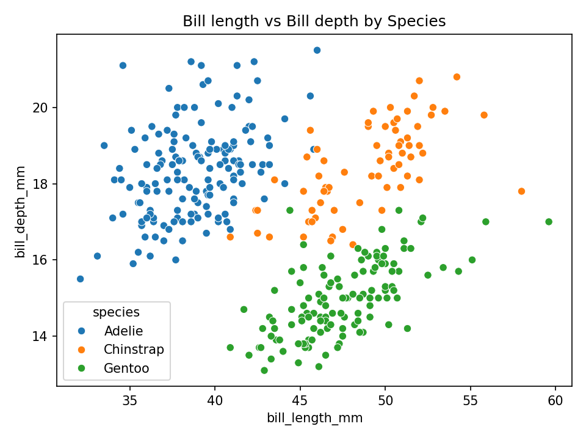

**인사이트:**

부리 길이와 부리 깊이의 산점도는 각 종(species)별로 뚜렷한 분포 차이를 보여준다. 특히 Adélie(Adelie), Chinstrap, Gentoo 종 사이에서 부리 길이와 깊이의 조합이 서로 다른 클러스터를 구성한다. 이러한 클러스터는 형태학적 적응이나 먹이습성 차이를 반영할 가능성이 있다. 예컨대 한 종은 길고 얇은 부리를 갖고 다른 종은 짧고 두꺼운 부리를 갖는 식이다. 산점도 상에서 아웃라이어나 결측 처리된 점들이 존재하므로, 회귀선이나 군집분석을 추가하면 종별 특징을 더 정량적으로 확인할 수 있다. 또한 동일 종 내에서도 섬(island)이나 성별(sex)에 따라 약간의 편차가 관찰되어 추가 교차분석으로 환경 요인의 영향을 평가할 수 있다.

### Pairplot (numeric)

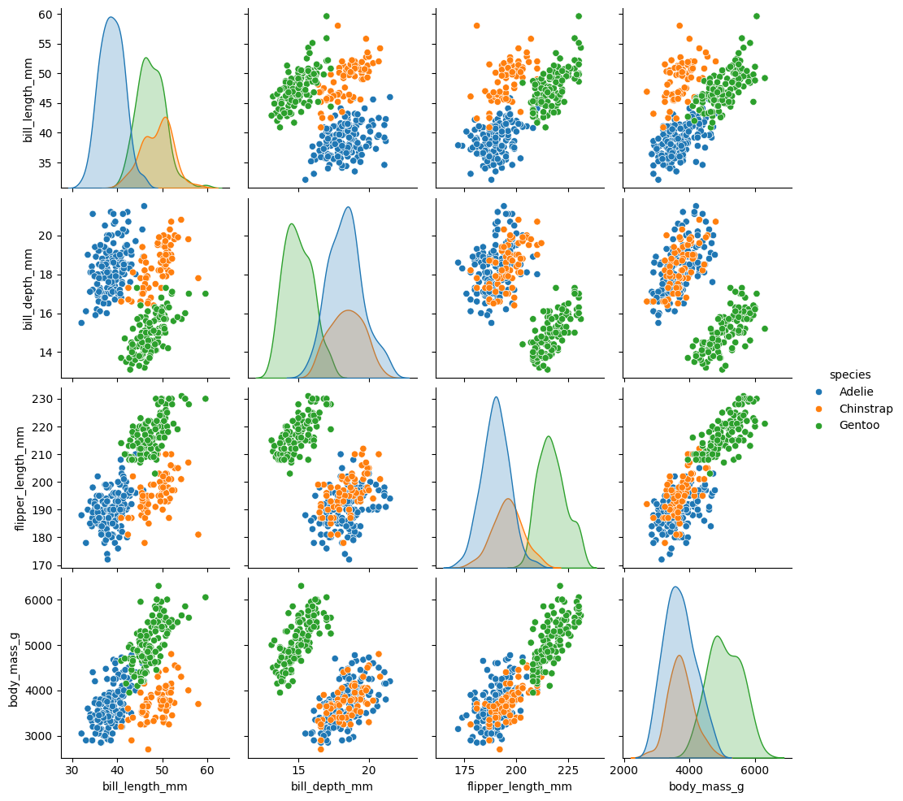

**인사이트:**

쌍분석 플롯은 모든 숫자형 변수 간의 2차원 관계와 각 변수의 분포를 동시에 보여준다. 종별 색상 분리는 변수들 간의 상호작용에서 종 구별 가능성을 시각적으로 확인하게 해준다. 예를 들어 지느러미 길이(flipper_length_mm)와 체중(body_mass_g)은 강한 양의 상관관계를 보이며, 이는 큰 지느러미를 가진 개체가 상대적으로 무거운 경향임을 시사한다. 반면 부리 길이와 체중 간 상관은 덜 뚜렷해 종별로 다른 패턴을 보일 수 있다. 쌍분석 플롯을 통해 특징 선택(feature selection)이나 다변량 군집분석의 후보 변수를 선별할 수 있다.

### Histogram of body_mass_g

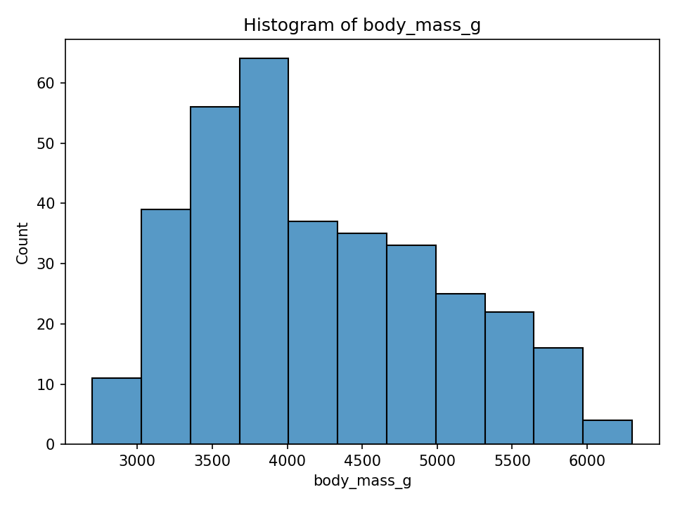

**인사이트:**

체중의 히스토그램은 관측치의 전반적인 분포(편향성, 다봉성 등)를 보여준다. 이 데이터에서는 체중이 거의 연속적으로 분포하되 종별로 중심위치가 다르게 나타난다. 예컨대 Gentoo 종은 비교적 높은 체중 범위를 가지며, Adelie는 중간, Chinstrap는 상대적으로 다른 분포를 보일 수 있다. 히스토그램의 꼬리나 뾰족한 피크는 샘플링 편향이나 측정단위 차이에서 기인할 수 있으므로, 로그 변환 또는 종별 분리 히스토그램으로 세부 패턴을 검토하는 것이 유용하다.

### KDE of body_mass_g by Species

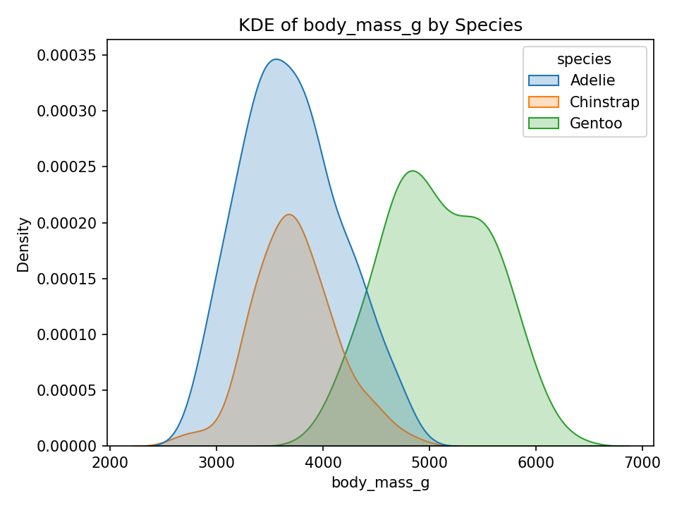

**인사이트:**

커널 밀도추정(KDE)은 각 종의 체중 분포 모양을 부드럽게 보여준다. 종별 KDE를 중첩하면 분포의 중첩 영역과 분리된 영역을 통해 종 간 체중 차이를 직관적으로 파악할 수 있다. 분포가 뚜렷하게 분리되어 있으면 단일 변수만으로도 종 구분이 어느 정도 가능하다는 신호이며, 겹침이 많으면 다변량 특징이 필요함을 시사한다. 또한 KDE의 폭(분산)은 종 내 이형성(intraspecific variation)을 의미하므로, 보전·생태 연구에서는 개체군의 다양성을 해석하는데 도움이 된다.

### Body mass by Species (boxplot)

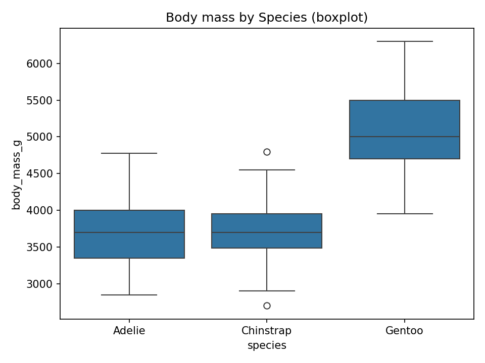

**인사이트:**

상자그림은 중앙값, 사분위수, 그리고 잠재적 이상값을 보여준다. 종별로 중앙값의 차이가 뚜렷하면 평균 또는 중앙값 기반의 비교(예: t-test, Mann-Whitney)를 통해 통계적 유의성을 검토할 수 있다. 상자 길이(사분위 범위)가 큰 종은 개체 내 변이가 크다는 뜻이며, 이상치(outlier)는 개체 수준의 특이 사례 또는 데이터 오류일 수 있다. 종간 비교 시 표본수 차이와 결측치를 고려해야 한다.

### Flipper length by Species (violin)

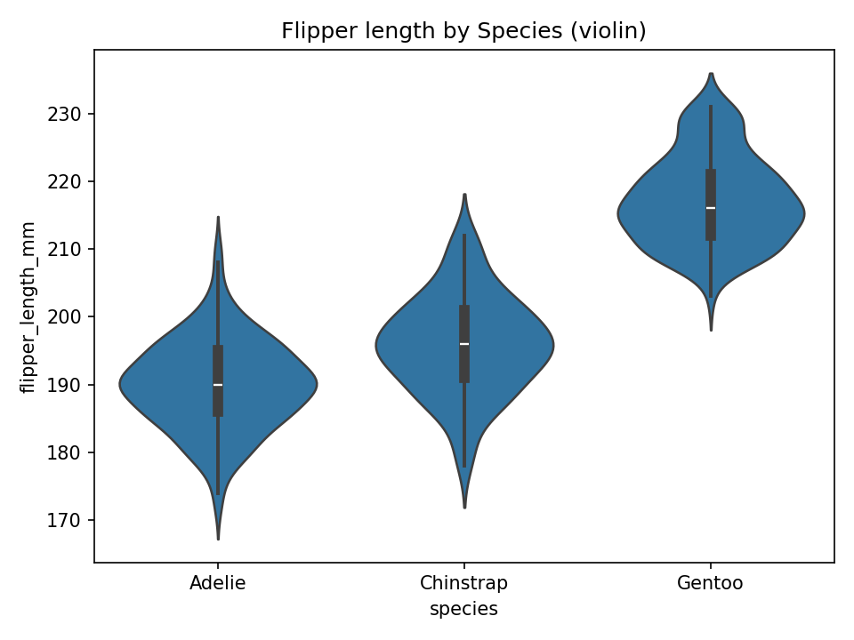

**인사이트:**

바이올린 플롯은 분포의 형태(다봉성 포함)를 보여줘서 단순한 상자그림보다 더 많은 정보를 제공한다. 지느러미 길이의 분포에서 특정 종이 다봉성이나 긴 꼬리를 보이면, 그 종 내에서 연령대나 성별에 따른 하위 그룹이 존재할 가능성이 있다. 이를 확인하려면 성별·섬 등 추가 범주화 변수로 분리해 비교하거나 혼합분포(mixture model)로 모형화해볼 수 있다.

### Bill length by Species (stripplot)

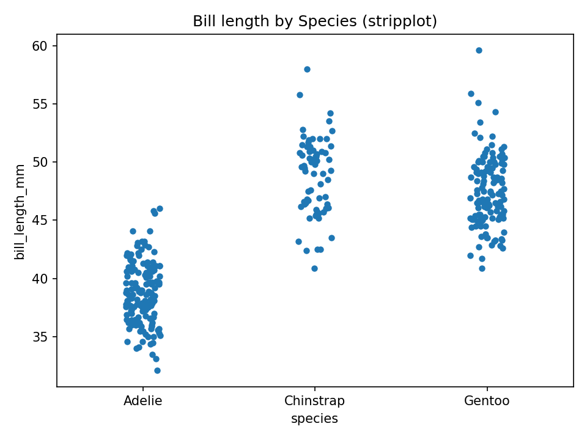

**인사이트:**

스트립플롯은 각 관측치를 개별 점으로 보여주어 분포의 상세한 밀집도를 파악할 수 있다. 부리 길이의 경우 종별 점 분포를 통해 군집과 겹침 영역을 확인할 수 있으며, 점들의 겹침을 줄이기 위해 지터를 적용해 관측치 밀도를 시각적으로 확인할 수 있다. 스트립플롯은 샘플 크기가 작을 때 특히 유용하며, 개별 이상값 식별에도 도움이 된다.

### Bill depth by Species (swarmplot)

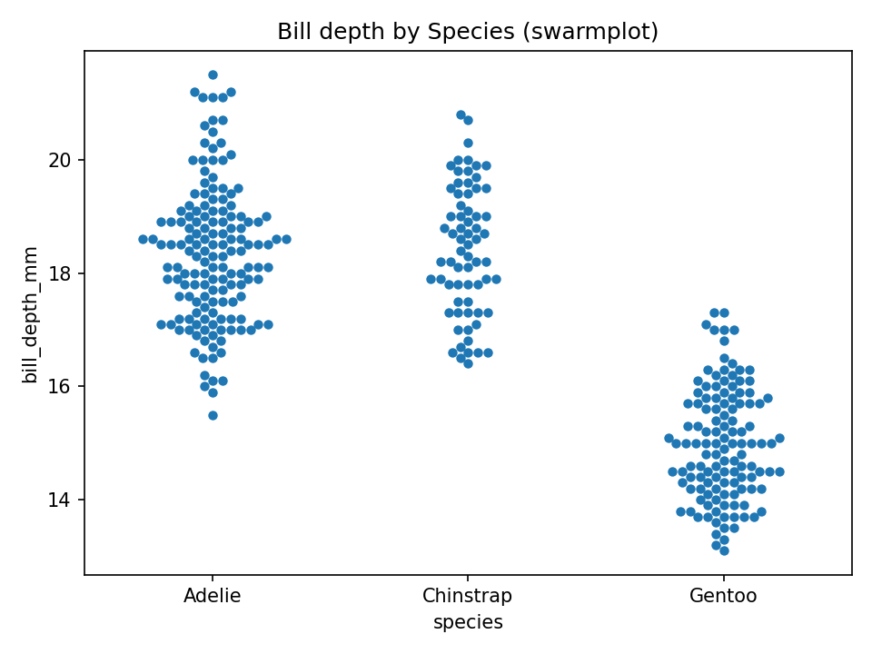

**인사이트:**

스웜플롯은 점을 겹치지 않게 정렬하여 각 그룹의 분포를 더 명확히 보여준다. 부리 깊이의 종별 스웜플롯을 보면 어떤 종이 더 넓은 분산을 가지는지, 특정 범위에 관측치가 집중되는지를 직관적으로 읽을 수 있다. 스웜플롯은 범주별 비교와 함께 통계적 검정을 병행하면 개체군 차이를 해석하는 데 강력한 도구가 된다.

### Correlation heatmap (numeric features)

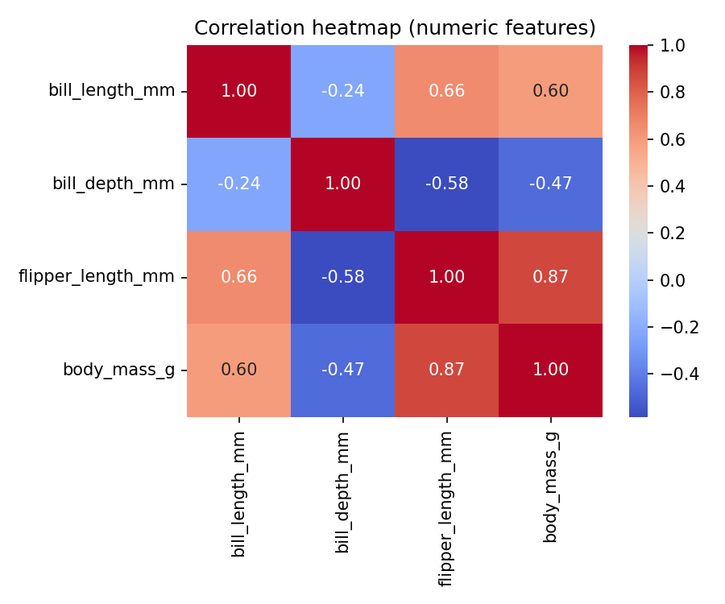

**인사이트:**

숫자형 변수 간 상관계수를 히트맵으로 표현하면 변수들 간의 선형관계를 한눈에 파악할 수 있다. 예컨대 지느러미 길이와 체중 사이의 높은 양의 상관은 생체계측적 동조화를 의미하며, 변수 선택이나 다중공선성 검사에 유용하다. 반면 강한 상관성은 회귀모형에서 다중공선성 문제를 일으킬 수 있으니 PCA 같은 차원축소 기법으로 보완을 고려해야 한다.

### Counts per Species

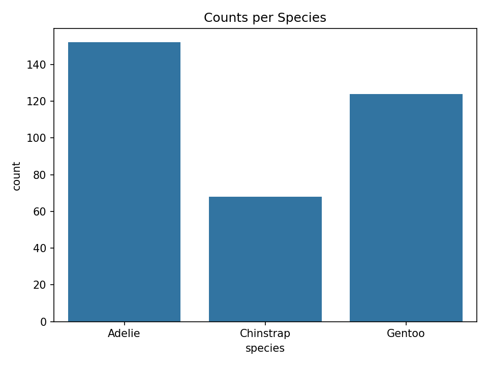

**인사이트:**

종별 개수 막대그래프는 각 종의 샘플링 빈도를 보여준다. 표본수가 균등하지 않으면 통계비교 시 가중치 보정이나 표본수 차이를 고려한 방법을 사용해야 한다. 예컨대 한 종이 과대표집되면 그 종의 특성이 전체 분석 결과를 편향시킬 수 있다. 데이터 수집 단계에서 표본 균형을 맞추거나 모델링 단계에서 표본 가중치를 적용하는 것이 바람직하다.

### Counts per Island

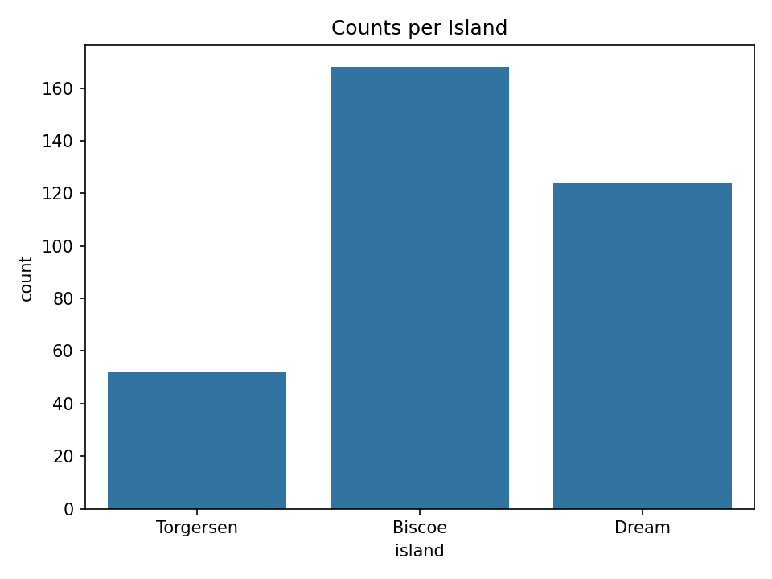

**인사이트:**

섬별 분포는 지리적 분산과 서식지 관련 요인을 반영한다. 특정 섬에서 한 종의 관측이 집중되면 해당 섬의 환경(먹이·기후 등)과 종의 적응성 연관성을 의심할 수 있다. 섬과 종 간 상호작용을 교차분석하거나 공간적 요인을 모형에 포함하면 생태적 해석을 강화할 수 있다.

### Counts per Sex

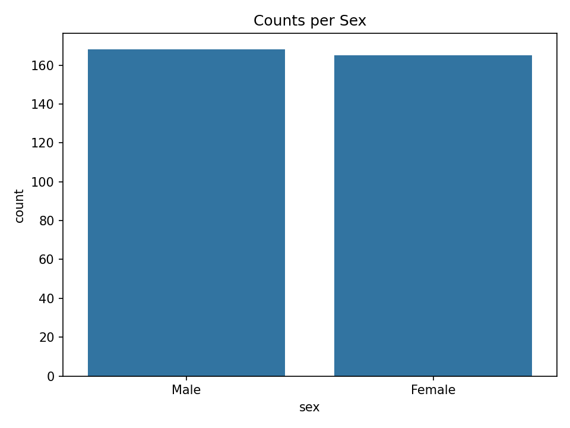

**인사이트:**

성별 분포는 성비(skew)가 있는지 확인하게 해준다. 성비가 한쪽으로 치우치면 성별에 따른 생태적 또는 표본수 편향을 고려해야 하며, 성별을 통제변수로 포함한 분석이 필요하다.

### Stacked (percent) species by island

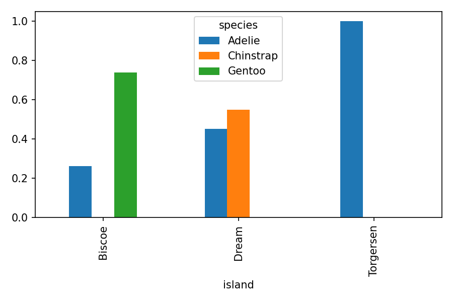

**인사이트:**

스택형 막대(비율)는 섬별로 종 구성 비율의 차이를 보여준다. 어떤 섬은 특정 종이 우점하면서 군집구조가 단순한 반면, 다른 섬은 종 다양성이 높을 수 있다. 이러한 패턴은 섬간 생태적 조건 차이, 경쟁적 배타성, 또는 인간 영향 등의 요인과 연관될 수 있으므로 추가적인 환경 데이터와 결합한 다변량 분석을 권장한다.

## 막대그래프 관련 교차표 및 피벗테이블

### 종(species) vs 섬(island) 교차표

| species   |   Biscoe |   Dream |   Torgersen |
|:----------|---------:|--------:|------------:|
| Adelie    |       44 |      56 |          52 |
| Chinstrap |        0 |      68 |           0 |
| Gentoo    |      124 |       0 |           0 |

### 종별-섬별 평균 body_mass_g 피벗테이블

| species   |   Biscoe |   Dream |   Torgersen |
|:----------|---------:|--------:|------------:|
| Adelie    |  3709.66 | 3688.39 |     3706.37 |
| Chinstrap |   nan    | 3733.09 |      nan    |
| Gentoo    |  5076.02 |  nan    |      nan    |

## 추가 통계

### 결측치 요약

|                   |   missing_count |
|:------------------|----------------:|
| species           |               0 |
| island            |               0 |
| bill_length_mm    |               2 |
| bill_depth_mm     |               2 |
| flipper_length_mm |               2 |
| body_mass_g       |               2 |
| sex               |              11 |

---

Generated by analysis.py
